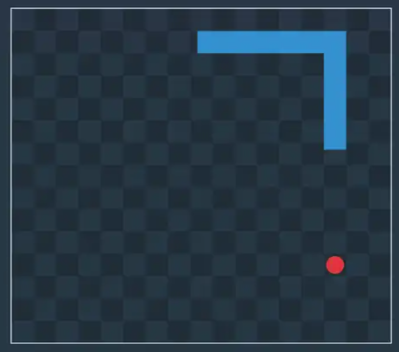
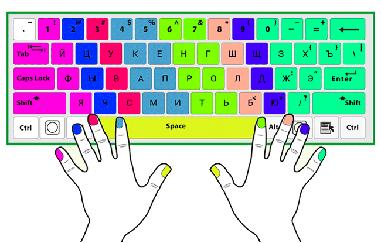
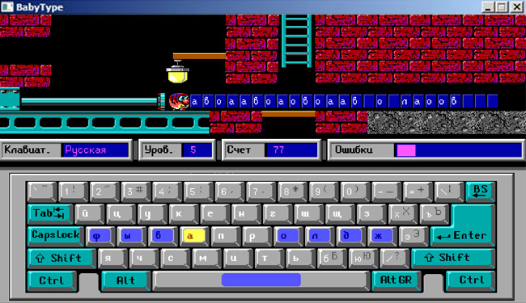

# Урок №14

# ДЗ

### Всю домашку необходимо реализовать в по пути `public/games`.
#### Для все игры вставляются и будут работать в:
```html
<div id="app"></div>
```

1) Для игры в змейку (`SnakeGame`) необходимо реализовать и стилизовать Таблицу перемещения змейки. Создать необходимую структуру папок и файлов в `public/games`
   Описать всю html только через js.
   Для файла/файлов стилей создать отдельную папку.
   Точка входа в игру реализовуется в `public/main.js` который уже подключен в html.
   
   **Референс поля змейки:**
   
   

   Т.е. поле аналог шахмотной доски. Количество колонок и строк любое, главное не меньше 15 (т.е. 15х15).
   Клетки должны чередовать цвет как в стобцах так и в строках, т.е. если строка начиналась с клетки одного цвета,
   То следующая строка должна начинаться с клетки другого цвета.
   Стоит использовать таблицу, т.е. теги таблицы для html.


2) Для обучения быстро печатать - игра (`TapGame`) - Нужно отрисовать клавиатуру в нижней части экрана.
   Стоит подумать о хранении данных для клавиатуры, чтоб была возможность расширения игры. Допустим добавления 
   Печати в верхнем регистре, или смены раскладки. Клавиши не используемые для печати можно оставить заглушками.
   Пока нужна только русская раскладка.

   **Референсы:**

   
   

### *Всю структуру файлов и папок нужно создать самому в папке games (имена игр указаны в заданиях)*

**Материалы**


[setTimeout & setInterval](https://learn.javascript.ru/settimeout-setinterval)

[Навигация по DOM элементам](https://learn.javascript.ru/dom-navigation)

[Поиск: getElement*, querySelector*](https://learn.javascript.ru/searching-elements-dom)

[Свойства узлов](https://learn.javascript.ru/basic-dom-node-properties)

[Атрибуты и свойства](https://learn.javascript.ru/dom-attributes-and-properties)

[Вставка и удаление](https://learn.javascript.ru/modifying-document)

[Добавление скриптов в HTML](https://learn.javascript.ru/script-async-defer)

[События `onload` `onerror`](https://learn.javascript.ru/onload-onerror)

[Таблица](http://htmlbook.ru/html/table)


