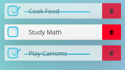

### Урок №6

### ***Стили и т.п. на свое усмотрение***

1) C сервера приходит неизвестное количество элементов списка `todo` в формате:
 ```javascript
const todos = [
  {
    id: 1,                // ID
    title: 'Купить хлеб', // Что нужно сделать
    performed: true,      // Выполнено ли
    createdAt: 1670837353756, // Время создания в формате `timestmap`
  },
  
  ...rest,
]
```
Список состоит из чекбокса, текста и кнопки удалить.
**!Список нужно отрисовать по дате (`createdAt`) создания изначально он приходит не отсортированным!**





Нужно реализовать 3 метода отрисовки этого списка.
 - Отрисовать весь список если `todo` выполнена то перечеркиваем текст и устанавливаем `checkbox` в отмеченный, и меняем стили (на свой вкус, можно добавить opacity, сменить бг и т.п.)
 - Отрисовать только Выполненные
 - Отрисовать только не выполненные.

Нужно отрисовать только десять элементов списка (любого из 3 выше описанных), и под самим списком отобразить кнопку "Загрузить еще" если в полученном (полученном для отрисовки, а не с "сервера") списке больше 10 элементов.

Сама отрисовка происходит только по первому методу (т.е. весь список), но во время проверки будем смотреть все три метода.

Нужно временно отключить отрисовку клавиатуры, и подставить нужный файл.
Сейчас `todos` генерятся в файл `public/todo-list/todo-list.js`.
Весь необходимый код нужно реализовать там-же, либо разнести на модули.
в папке связанной с текущей задачей нужно создать стили, и правильно их подключить.

2) Если элементов больше 10, отобразить сколько еще элементов скрыто (т.е. отображаем 10, и где-то надпись - "еще 150") где  отображать и стили, на свое усмотрение.

3) ** `Дополнительно` - Над списком реализовать поле ввода и кнопку, для добавления новых дел в список.


**Материалы**


[Поиск элементов](https://learn.javascript.ru/searching-elements-dom)

[Свойства элементов](https://learn.javascript.ru/basic-dom-node-properties)

[Атрибуты](https://learn.javascript.ru/dom-attributes-and-properties)

[Вставка и удаление](https://learn.javascript.ru/modifying-document)

[Добавление скриптов в HTML](https://learn.javascript.ru/script-async-defer)

[Методы массивов](https://learn.javascript.ru/array-methods)

[Метод map](https://developer.mozilla.org/ru/docs/Web/JavaScript/Reference/Global_Objects/Array/map)

[Метод some](https://developer.mozilla.org/ru/docs/Web/JavaScript/Reference/Global_Objects/Array/sort)

[Метод includes](https://developer.mozilla.org/ru/docs/Web/JavaScript/Reference/Global_Objects/Array/includes)

[Метод filter](https://developer.mozilla.org/ru/docs/Web/JavaScript/Reference/Global_Objects/Array/filter)

[Метод find](https://developer.mozilla.org/ru/docs/Web/JavaScript/Reference/Global_Objects/Array/find)


